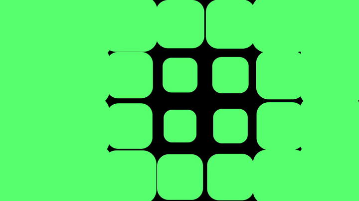

# Gradient Driver for After Effects



Gradient Driver is an After Effects script that connects selected properties to a generated gradient field. Black drives a property to its `Min` control, white drives it to its `Max` control.

The repository includes two versions:

- `GradientDriver.jsx`: optimized Ramp version. Fast and stable. Reads Ramp effect parameters directly.
- `GradientDriver_sampleImage.jsx`: bonus sampleImage version. Slower, but reads real rendered pixels from the gradient source.

## Install

Copy one of the scripts to your After Effects Scripts folder, or run it through:

```text
File > Scripts > Run Script File...
```

## Usage

1. Open a composition.
2. Select one or more properties in the timeline.
3. Run `GradientDriver.jsx`.
4. The script creates:
   - `Driver Control`
   - `Start Driver`
   - `End Driver`
   - `Driver Gradient Source`
5. Adjust `Min ...` and `Max ...` controls on `Driver Control`.
6. Move `Start Driver` and `End Driver` to reshape the radial driver field.

## How It Works

The optimized script reads the Ramp effect directly:

- `Start of Ramp`
- `End of Ramp`
- `Start Color`
- `End Color`

It calculates where each driven layer sits inside the Ramp field, converts that to brightness, then maps brightness to `Min` and `Max`.

```text
black -> Min
white -> Max
```

Because the optimized version reads Ramp parameters, the gradient layer can stay hidden and disabled.

## Control Grouping

The script tries to avoid creating hundreds of duplicate controls:

- Proportional Scale values, such as `[100, 100]`, share one Slider control pair.
- Non-proportional Scale values, such as `[120, 80]`, use a Point control pair for X/Y.
- Z Scale is preserved and not driven.
- Other properties are grouped conservatively only when name, type, output, and Min/Max ranges match.

This avoids accidentally linking unrelated sliders that happen to have the same numeric values.

## Optimized vs sampleImage

`GradientDriver.jsx` is the recommended default.

It is fast because it does not render or sample pixels. It reads Ramp controls as numbers. The tradeoff is that effects, masks, plugins, and precomps on the gradient layer are not evaluated.

`GradientDriver_sampleImage.jsx` reads actual pixels with `sampleImage()`. Use it when you need the driver to react to real images, masks, blur, noise, precomps, or plugins. It can be much slower, and the source layer must stay enabled.

## Caveats

- The script overwrites expressions on selected properties.
- Existing expressions should be backed up before running the script.
- The optimized version is limited to the generated Ramp field.
- The sampleImage version is more flexible but can become slow with many layers or heavy effects.
- The source field is based on each driven layer's anchor point.

---

# Gradient Driver для After Effects


Gradient Driver - скрипт для After Effects, который привязывает выделенные параметры к градиентному полю. Черное значение ведет параметр к `Min`, белое значение ведет параметр к `Max`.

В репозитории две версии:

- `GradientDriver.jsx`: оптимизированная Ramp-версия. Быстрая и стабильная. Читает параметры Ramp effect напрямую.
- `GradientDriver_sampleImage.jsx`: бонусная sampleImage-версия. Медленнее, но читает реальные пиксели source layer.

## Установка

Скопируйте один из скриптов в папку Scripts After Effects или запустите через:

```text
File > Scripts > Run Script File...
```

## Использование

1. Откройте композицию.
2. Выделите один или несколько параметров в timeline.
3. Запустите `GradientDriver.jsx`.
4. Скрипт создаст:
   - `Driver Control`
   - `Start Driver`
   - `End Driver`
   - `Driver Gradient Source`
5. Настройте `Min ...` и `Max ...` на `Driver Control`.
6. Двигайте `Start Driver` и `End Driver`, чтобы менять radial driver field.

## Как Это Работает

Оптимизированный скрипт читает Ramp effect напрямую:

- `Start of Ramp`
- `End of Ramp`
- `Start Color`
- `End Color`

Он считает, где находится слой внутри поля Ramp, переводит это в яркость и мапит яркость в `Min` / `Max`.

```text
черное -> Min
белое -> Max
```

Так как оптимизированная версия читает параметры Ramp, gradient layer может быть скрытым и выключенным.

## Группировка Контролов

Скрипт старается не создавать сотни одинаковых крутилок:

- Пропорциональный Scale, например `[100, 100]`, получает одну общую пару Slider-контролов.
- Непропорциональный Scale, например `[120, 80]`, получает Point control для X/Y.
- Z Scale сохраняется и не драйвится.
- Остальные параметры объединяются осторожно: только если совпадает имя, тип, output и диапазон Min/Max.

Так меньше шанс случайно связать разные sliders только потому, что у них одинаковые числа.

## Optimized vs sampleImage

`GradientDriver.jsx` - основной рекомендуемый вариант.

Он быстрый, потому что не рендерит и не семплит пиксели. Он читает контролы Ramp как числа. Минус: эффекты, маски, плагины и precomp на gradient layer не учитываются.

`GradientDriver_sampleImage.jsx` читает реальные пиксели через `sampleImage()`. Используйте его, если driver должен реагировать на картинки, маски, blur, noise, precomp или плагины. Он может быть намного медленнее, а source layer должен оставаться включенным.

## Подводные Камни

- Скрипт перезаписывает expressions на выделенных параметрах.
- Старые expressions лучше сохранить перед запуском.
- Оптимизированная версия ограничена созданным Ramp field.
- sampleImage-версия гибче, но может тормозить на большом количестве слоев или тяжелых эффектах.
- Driver field считается по anchor point каждого управляемого слоя.
